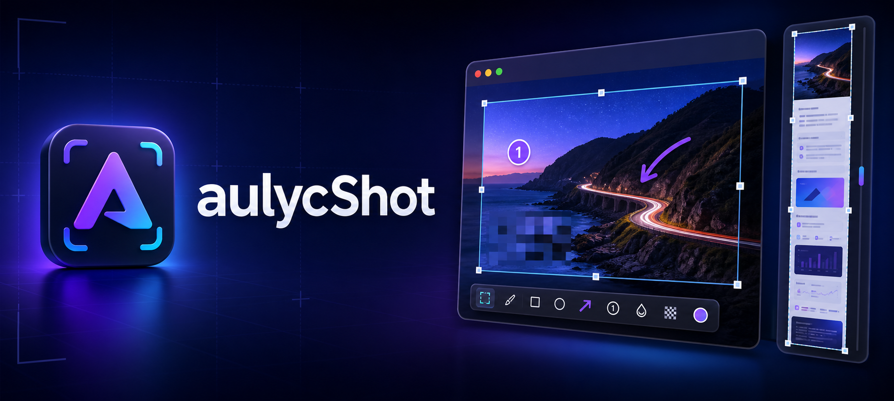
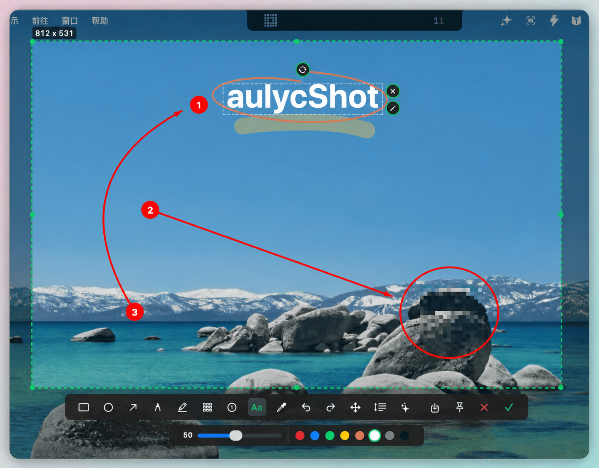
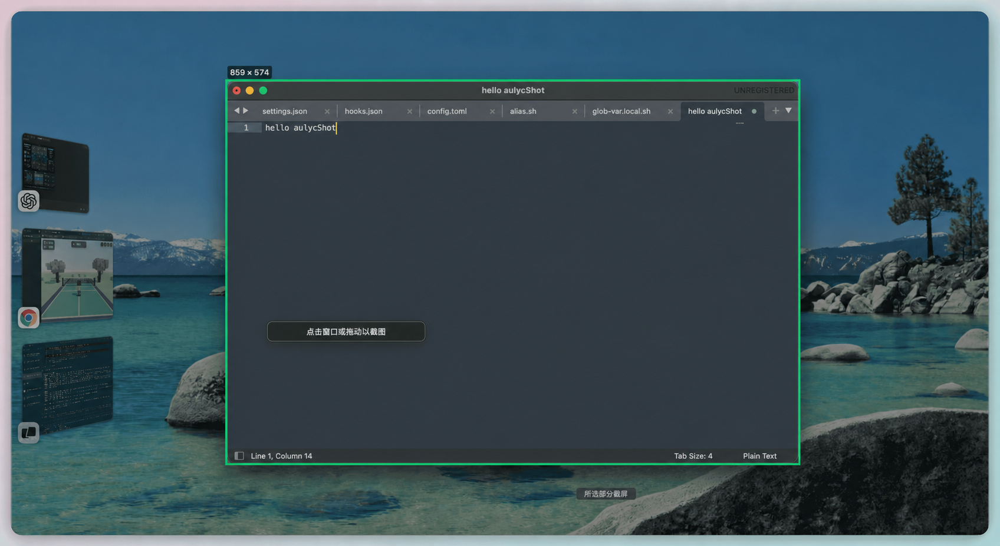
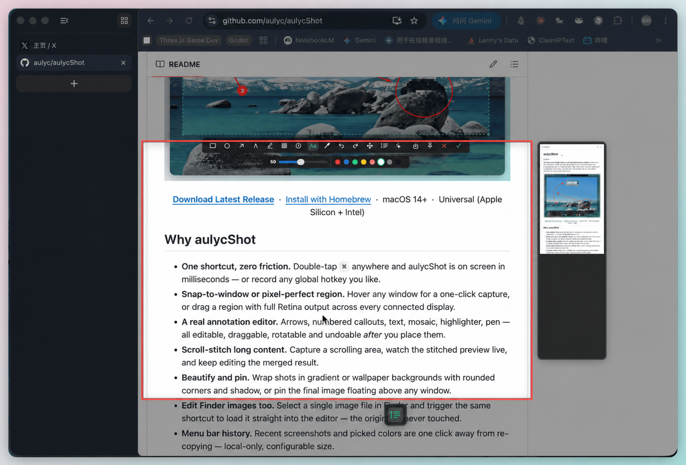

<p align="center">
  
</p>

<h1 align="center">aulycShot</h1>

<p align="center">
  Outil de capture d'écran pour la barre des menus macOS : double-cliquez sur <code>⌘</code> pour capturer, annoter, assembler une longue page et épingler.
</p>

<p align="center">
  <a href="https://github.com/aulyc/aulycShot/releases/latest"></a>
  
  
  <a href="LICENSE"></a>
</p>

<p align="center">
  <a href="README.md">简体中文</a> ·
  <a href="README.zh-TW.md">繁體中文</a> ·
  <a href="README.en.md">English</a> ·
  <a href="README.ja.md">日本語</a> ·
  <a href="README.ko.md">한국어</a> ·
  <a href="README.fr.md">Français</a> ·
  <a href="README.ru.md">Русский</a> ·
  <a href="README.vi.md">Tiếng Việt</a>
</p>

<p align="center">
  <a href="https://github.com/aulyc/aulycShot/releases/latest">Télécharger</a> ·
  <a href="CHANGELOG.md">Changelog</a> ·
  <a href="https://github.com/aulyc/aulycShot/issues">Issues</a>
</p>

**Le moyen le plus rapide de capturer, annoter et partager des captures d'écran sur macOS.** Double-cliquez sur `⌘` depuis n'importe quelle app, capturez une fenêtre ou une zone, assemblez une page longue, puis annotez dans une fenêtre flottante. aulycShot vit dans la barre des menus, sans icône Dock, sans télémétrie, sans abonnement et sans dépendance tierce.

<p align="center">
  
</p>

## Pourquoi aulycShot

- **Un raccourci, aucun frottement** : double-cliquez sur `⌘` ou utilisez votre raccourci global personnalisé.
- **Fenêtre ou zone précise** : cliquez une fenêtre détectée, ou faites glisser une zone avec sortie Retina.
- **Un vrai éditeur d'annotations** : flèches, numéros, texte, mosaïque, surligneur et stylo restent modifiables après placement.
- **Capture longue** : faites défiler dans la zone sélectionnée, prévisualisez l'assemblage, puis continuez l'édition.
- **Épingler les captures** : gardez l'image finale au-dessus des autres fenêtres comme référence.
- **Modifier les images Finder** : sélectionnez une image dans Finder et ouvrez-la directement dans l'éditeur sans toucher au fichier d'origine.
- **AppKit pur** : pas de SwiftUI, pas d'Electron, pas de télémétrie.

## Aperçu

<table>
<tr>
  <td width="50%" align="center"><br/><sub><b>Capture de fenêtre en un clic</b><br/>aulycShot détecte automatiquement les bords.</sub></td>
</tr>
<tr>
  <td width="50%" align="center"><br/><sub><b>Assembler les longues pages</b><br/>Faites défiler et voyez le résultat en direct.</sub></td>
</tr>
</table>

## Prérequis

- macOS 14.0 ou plus récent
- Permission Accessibilité pour le déclencheur `⌘`
- Permission Enregistrement de l'écran pour ScreenCaptureKit
- Permission Automatisation Finder pour modifier l'image sélectionnée

Le statut unifié des fonctionnalités devient disponible uniquement lorsque les autorisations Accessibilité et Enregistrement de l'écran sont toutes les deux activées. Sinon, les actions de capture et d'enregistrement sont bloquées et ouvrent le guide d'autorisation combiné.

## Avertissement de vérification macOS

Si macOS affiche un avertissement du type `Apple ne peut pas vérifier que "aulycShot" est exempt de logiciels malveillants`, supprimez l'attribut quarantine du bundle d'app que vous jugez fiable, puis ouvrez-le à nouveau :

```bash
xattr -dr com.apple.quarantine /Applications/aulycShot.app
```

Si vous exécutez une version compilée localement au lieu de l'app dans `/Applications`, remplacez le chemin par son emplacement réel, par exemple :

```bash
xattr -dr com.apple.quarantine ./.cache/build/aulycShot.app
```

N'exécutez cette commande que pour des builds en lesquels vous avez confiance, par exemple une version téléchargée depuis ce dépôt ou compilée vous-même.

## Compilation depuis les sources

```bash
./scripts/bundle.sh
```

Pour le développement local :

```bash
bash scripts/rebuild-and-open.sh
```

## Utilisation

1. Double-cliquez sur `⌘ Command`, utilisez votre raccourci ou choisissez la capture dans la barre des menus.
2. Cliquez une fenêtre ou faites glisser une zone.
3. Utilisez la barre flottante pour annoter, capturer en défilement, enregistrer, épingler ou confirmer.
4. Cliquez la coche verte ou appuyez sur `Enter` pour copier le résultat. `Esc` ou `x` annule.

## Outils d'édition

| Outil | Rôle |
| --- | --- |
| Rectangle / ellipse | Dessiner des formes avec couleur et épaisseur |
| Flèche | Dessiner une flèche et ajuster points ou courbe ensuite |
| Stylo / surligneur | Tracer à main levée ou surligner |
| Mosaïque | Pixelliser les zones sensibles |
| Numéro / texte | Ajouter des repères numérotés ou du texte éditable |
| Capture longue / épingler | Finaliser et partager l'image |

## Réglages

Les réglages couvrent la langue, l'icône de barre des menus, le lancement à l'ouverture de session, le mode démo, les raccourcis et les accès rapides aux permissions. L'interface prend en charge 简体中文 et English.

## Star History

[Voir l’historique des étoiles de aulycShot](https://www.star-history.com/?repos=aulyc%2FaulycShot&type=date&legend=top-left)

## Licence

[MIT](LICENSE) · [Third-party notices](THIRD_PARTY_NOTICES.md)
